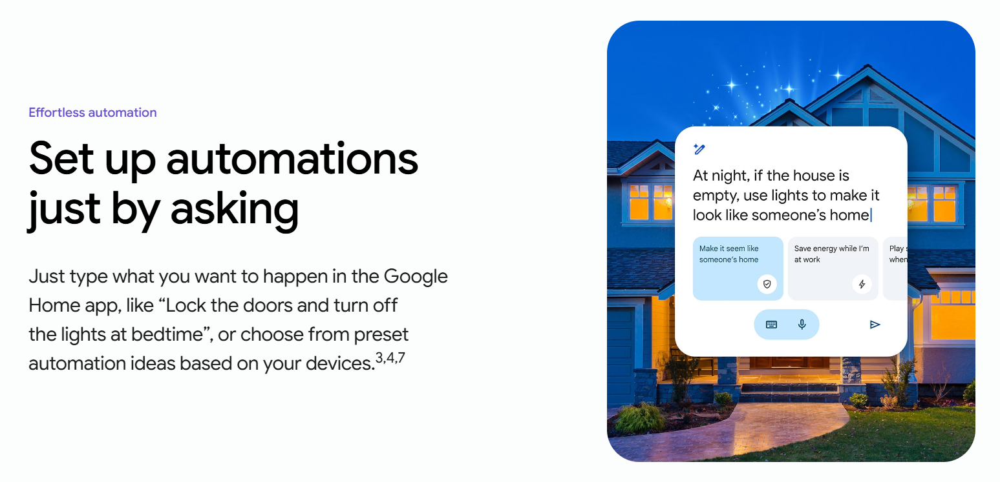
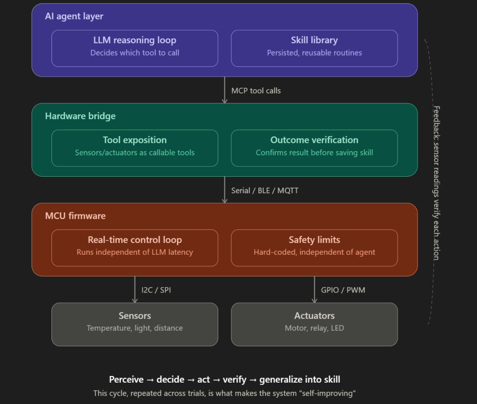
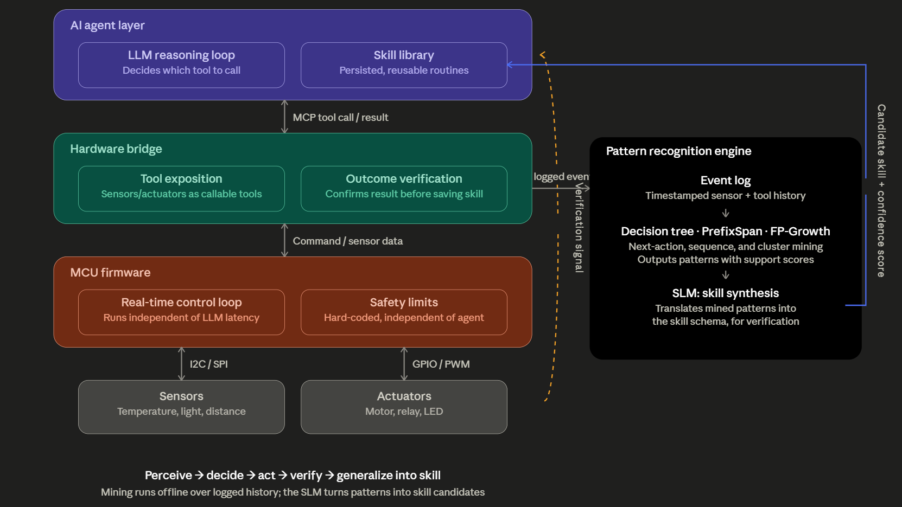
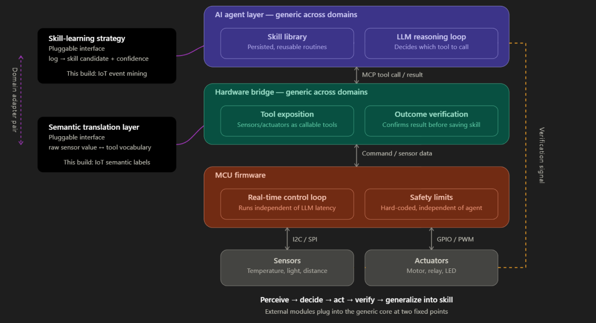
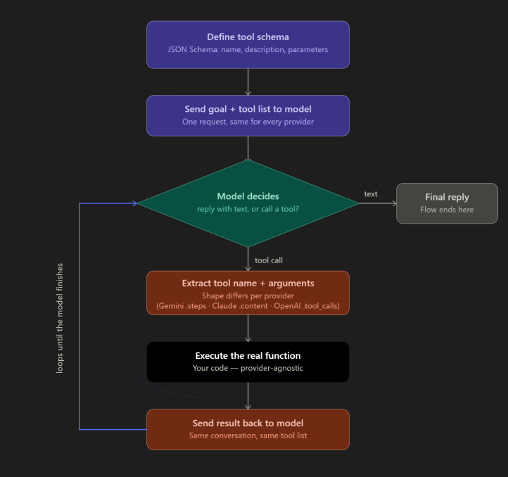
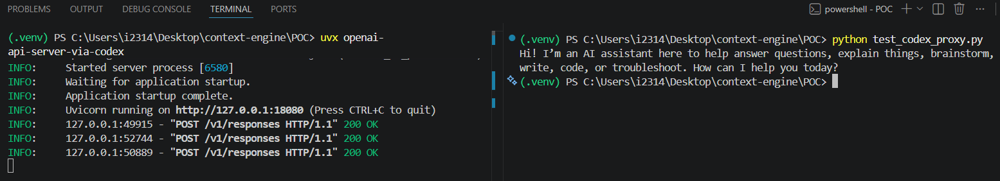

# SenseLearn — A Hardware Interface for Self-Improving AI Agents

## Project Overview

SenseLearn is a hardware interface that lets a self-improving AI agent observe a real physical environment and autonomously write, validate, and deploy its own automation behavior — with no hardcoded logic. It bridges an agentic AI framework with a privacy-preserving WiFi Channel State Information (CSI) sensing setup, so the agent has a real-world environment to learn in: rooms that become occupied or vacant, lights and fans that get switched on or off, and human behavior patterns that repeat over time.

## Core Idea

Most smart-home automation is either manually configured or trained on large datasets. This project asks a narrower, harder question instead:

> **Can an AI agent observe a small number of real-world events (as few as 2–3) and reliably write its own correct, generalizable, executable automation rule — then hand it off to run locally, in real time, without further involvement?**

The agent is expected to:
1. **Observe** — read a live log of sensor events (room occupancy, motion) and human-triggered actuator actions (e.g. someone manually switching on a light).
2. **Recognize patterns** — notice a behavior repeating across a small number of events (e.g. bedroom goes vacant at night → hallway light turns on, seen 2–3 times).
3. **Form a hypothesis** — propose a candidate rule describing the pattern it believes it has found.
4. **Backtest** — replay the candidate rule against recent event history to check it holds up before trusting it, catching coincidental or overfit patterns. (Still decidiing on the depth)
5. **Write code** — if the backtest passes, author an actual executable skill implementing the behavior — not a config value, real code — and add it to a growing skill library.
6. **Deploy locally** — hand the validated skill to a lightweight execution engine that runs independently of the LLM at runtime, reacting to live sensor events in real time.

## Why This Matters (Problem Framing)

Agentic AI systems can already write and reuse their own tools/skills in software environments. This project explores what it takes to extend that same self-improvement loop into the **physical world**, where:
- Actions have real, unforgivable consequences (a light stuck on, a fan running all night) — so validation before deployment matters more than in a purely digital sandbox.
- Reactions need to be fast and reliable — you cannot gate a light switch on a slow or unavailable LLM API call.
- Privacy matters — the sensing layer deliberately avoids cameras and wearables, using only WiFi infrastructure that already exists in most homes.

## Week 01 — Architecture Exploration
- Explored candidate agent frameworks named in the industry brief (OpenClaw, Hermes Agent); **selected Hermes Agent for its native skill-learning loop and sandboxed execution support.
- Defined high level system architecture
- Resolved  key open design decisions (see table below).
- **Testing local LLM feasibility on personal laptop this week (results to follow).

## Existing Solutions Analysis

### Gemini for Home Update (2026)

Google Home's newer Gemini integration adds AI-assisted automation creation, but it changes the *interface*, not the *underlying model* of how automations are made — this distinction is important for positioning this project's contribution.

**New capabilities introduced:**
- **"Help me create" / Ask Home** — users type or say what they want, and the app generates an automation to personalize and save
- **Gemini for Home voice assistant** — conversational, multi-turn interaction replacing the older command-based Assistant
- **Camera intelligence & Home Brief** — cameras describe specific events in natural language; a daily summary of home activity is generated
- **Google Home Vitals** — a new diagnostics initiative giving device partners tools to monitor connection health and reduce lag

**Why this still doesn't close the gap with this project:**

| What Gemini for Home does | What it still doesn't do |
|---|---|
| Generates an automation from a natural-language **prompt you give it** | Never observes behavior unprompted and proposes a rule on its own |
| Lets you "personalize and save" the generated automation | No backtesting against historical event logs before it goes live |
| Camera intelligence describes events in natural language | Runs directly against this project's privacy/no-camera design constraint |
| Google Home Vitals diagnoses cloud/connection lag | Still a cloud-side fix — automations still depend on internet/Wi-Fi; no move to local execution |
| Advanced features require Google Home Premium ($10–20/month) | This project has no subscription dependency by design |

**Key distinction: Even in the Gemini era, automation is still triggered by a human describing what they want in words — the system translates natural language into a routine. It does not watch what a household actually does and infer the routine itself. That is precisely the boundary this project sits on the other side of.**

**Takeaway: The problems this project's architecture was designed around — local execution, validation-before-deploy, autonomous rule authoring — are not hypothetical justifications; they are current, documented failure modes in the dominant commercial smart home platform.**

## Proposed High-Level System Architecture

## Key Design Decisions 

| Decision | Choice | Why |
|---|---|---|
| LLM execution location | On-device first (via Hermes Agent), cloud API as fallback | Privacy-preserving / Be independednt of third party services |
| Human confirmation before deploying a skill | **Required** | Safety  |
| Conflicting learned rules | Flagged for manual review, not auto-resolved | Keeps behavior predictable; avoids unscoped conflict-resolution logic |
| Demonstation of Faesibility | As a Smart Home Agent | Routine based systems already exsist for analytic comparisions, easy to simulate with less resources |

## Design Stack v1.0

| Layer | Component |
|---|---|
| Sensing hardware | ESP32 + standard sensors |
| Event store | **SQLite (local) |
| Agent framework |  |
| Model | **Local model (Ollama, under test) → cloud fallback via OpenRouter if needed |
| Hardware ↔ agent bridge | MCP server exposing sensors/actuators as agent tools |
| Skill validation | Hermes built-in sandbox backend (local/Docker) |

## THE LLM...

### What we need ;
1. **Reliable tool-calling** (correctly picks the right tool, fills in arguments correctly) — this matters far more than raw "intelligence" for your use case.
2. **Consitent skill generation and output schema**
3.  **Low cost & latency** that you can call it repeatedly during development and demos without worrying about API bills.
4.  **Ample enough reasoning** to notice patterns and ability to generalize them into skills

## Open Questions Going Forward

- Which protocl to use to tranfer sensor readings / data between ESP-32 and agentic layer?
- How to store the data collected for usage?
- AI Model architecture to be run? (Suggested to see faesibility of running the LLM locally)
- Final skill interface definition (what exact function signature/contract a generated skill must conform to) - for the MCP.
- Exact backtesting (whether we adapt it and if so the depth).

## Revised Generalized System Archiecture

## Project Phase Timeline

| Phase | Focus | Outcome |
|---|---|---|
| 0. Foundations | LLM access and tool-calling mechanism, no hardware involved | Agent can reliably call and receive structured tool requests |
| 1. Vertical slice (PoC) | Connect agent to real hardware via a bridge | Agent controls a physical actuator end-to-end |
| 2. Sensing | Replace mocked readings with real sensor input | Agent reasons over real-world data |
| 3. Reliability | Safety limits and outcome verification in the bridge/firmware | Actions are checked, not just assumed to work |
| 4. Learning | Pattern recognition over logged experience, generating new skills automatically | Agent builds its own skill library from repeated behavior |
| 5. Generalization | Formalize the learning and translation layers as swappable modules | Framework is portable across domains, not just this one setup |
| 6. Hardening | Stress-test failure modes and edge cases | System degrades safely rather than breaking |
| 7. Delivery | Documentation, diagrams, demo | Project is presentable and defensible |

## Week 01 — The POC
### Briefly
**GOAL:** Configuring an LLM to be able to use skills to move actuators and read sensors
**END-RESULT:** Getting an LLM to control a simple LED via ESP-32

**Progress:** 
    - The LLM - *Open AI LLMs

### 1. The LLM?
- I'll be planning towards
        User -> Server -> Cloud API 

- Why a middleman Server? This architecture is the most scalable.
- Current run will be with my perosnal laptop as the 'Server'.
- For the access to an LLM, I came across this Github project that allowed to convert OpenAI standard JSON requests into a Codex-compatible form. Then the conversation is streamed via Codex to an OpenAI LLM.

#### Reference [OpenAI API Server via Codex]([https://github.com/octocat/Hello-World](https://github.com/hotchpotch/openai-api-server-via-codex#openai-api-server-via-codex)).

### How?
- All LLMs follow a universal egenric flow when it comes to prompting, tool calling and feedback as below:

- What changes from model to model are the exact tool schemas & the sturctured output objects & how they are stored.

### Implementation 

